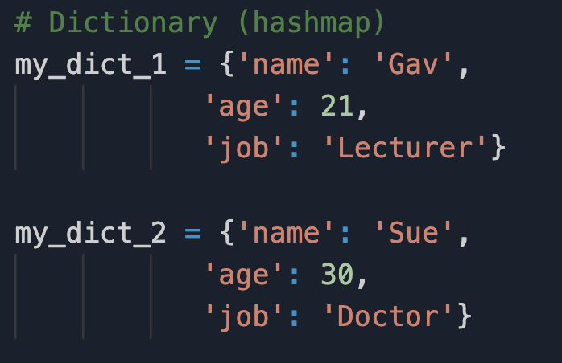

# Dictionaries
Python dictionaries are broadly equivalant to hashmaps and are unordered, changeable and indexed. Dictionaries consist of key/value pairs defined in curly braces.

Dictionaries provide quick access to items.

Example:

